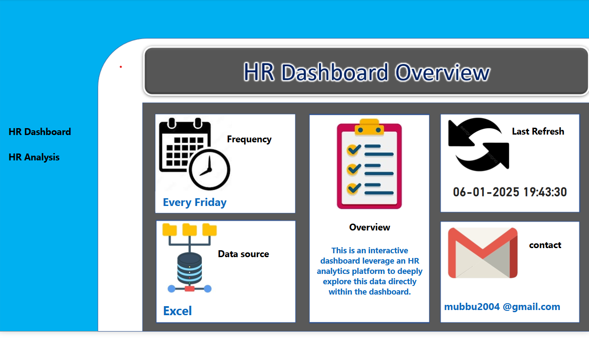
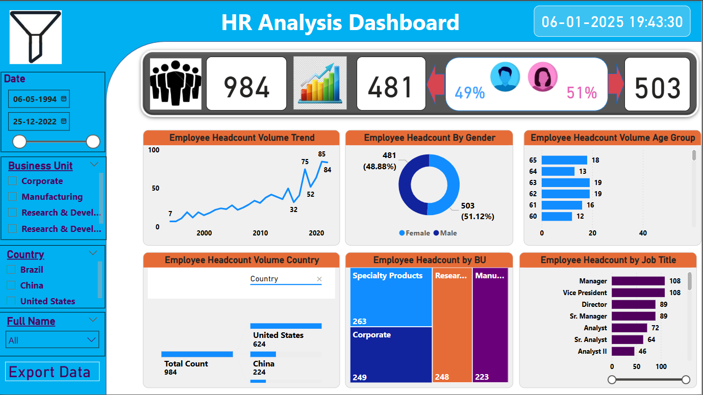

# 👨‍💼 HR Data Analysis

## 📌 Objective
This project focuses on HR analytics for a company (*XXX Excel Anywhere*) using Power BI. It provides key workforce insights to help businesses optimize HR strategies and make informed decisions.

## 🔍 Key Analysis & Insights
1️⃣ *Headcount Analysis* - Total employee count & year-over-year trends.  
2️⃣ *Gender Distribution* - Understanding diversity in the workforce.  
3️⃣ *Attrition Rates* - Identifying trends in employee turnover.  
4️⃣ *Department & Country-wise Breakdown* - Workforce distribution by business unit and location.  
5️⃣ *Age Group Analysis* - Employee distribution across different age brackets.  
6️⃣ *Interactive Slicers* - Filtering options for better insights.  
7️⃣ *Data Refresh Tracking* - Ensuring up-to-date HR metrics.  

## 📊 Summary Page Preview
  

## 📊 Dashboard Preview
  

📽 *Watch Dashboard Explanation* (7:15 min): [LinkedIn Video](https://www.linkedin.com/posts/md-mubarak_dataanalytics-hranalytics-dashboarddesign-activity-7282635902642802688-1Y_v?utm_source=social_share_video_v2&utm_medium=android_app&rcm=ACoAAEmLtsIBzGgZtPpqcJ-_qXH5wP6LlHkGRbU&utm_campaign=copy_link)

## 🛠 Technology Stack
✅ *Power BI* - Data visualization  
✅ *Excel* - Data storage & preprocessing  
✅ *GitHub* - Project hosting  

---

## 📂 Files in This Repository
📄 Employee Sample Data.xlsx - The dataset used for analysis  
📄 HR_Project_Scope.pdf - Project planning document  
📄 dashboard-image.png - Screenshot of the Power BI dashboard  
📄 README.md - Project overview  

---

## 🚀 How to Use
1. Download the dataset and open it in *Power BI* or *Excel*.  
2. Watch the *dashboard explanation video* for insights.  
3. Explore workforce metrics and HR trends.  

🔗 *Author*: Mubarak | 📧 [mohamedmubarakt@gmail.com](mailto:mohamedmubarakt@gmail.com)
